# TAMAM — Database Design (PostgreSQL 16 + PostGIS 3)

Source of truth: `apps/api/prisma/schema.prisma` (96 models) + `apps/api/prisma/sql/001_postgis_triggers_and_integrity.sql`.
All IDs are UUID (`gen_random_uuid()`), all timestamps `timestamptz` in UTC, all money `BIGINT` minor units with a `currency` column.

## 1. Core ERD

```mermaid
erDiagram
    users ||--o| customer_profiles : has
    users ||--o| partner_profiles : has
    users ||--o{ user_roles : has
    users ||--o{ user_sessions : has
    users ||--o| admin_credentials : has
    admin_roles ||--o{ admin_role_permissions : grants
    admin_permissions ||--o{ admin_role_permissions : in

    customer_profiles ||--o{ saved_places : keeps
    customer_profiles ||--o{ jobs : requests
    partner_profiles ||--o{ jobs : fulfils
    partner_profiles ||--o{ partner_roles : has
    partner_profiles ||--o{ partner_documents : uploads
    partner_profiles ||--o| partner_availability : reports
    partner_profiles ||--o{ vehicles : owns
    vehicle_types ||--o{ vehicles : classifies

    service_types ||--o{ service_categories : groups
    service_categories ||--o{ service_subcategories : groups
    service_subcategories ||--o{ service_options : offers
    service_zones ||--o{ zone_service_rules : configures
    service_zones ||--o{ jobs : contains

    jobs ||--o{ job_stops : has
    jobs ||--o{ job_assignments : offers
    jobs ||--o{ job_events : timeline
    jobs ||--o{ job_tracking_points : gps
    jobs ||--o| job_delivery_details : delivery
    jobs ||--o{ service_quotes : quotes
    service_quotes ||--o{ service_quote_items : lines
    jobs ||--o| pricing_snapshots : priced_by
    pricing_rules ||--o{ pricing_snapshots : frozen_into

    jobs ||--o{ payments : paid_by
    payments ||--o{ payment_attempts : tries
    payments ||--o{ refunds : refunded_by
    wallets ||--o| ledger_accounts : mirrors
    ledger_transactions ||--o{ ledger_entries : balances
    ledger_accounts ||--o{ ledger_entries : posts

    promo_codes ||--o{ promo_redemptions : used_in
    jobs ||--o| promo_redemptions : applies
    campaigns ||--o{ banners : shows
    banners ||--o{ banner_events : tracked
    banners ||--o{ banner_daily_stats : aggregated

    jobs ||--o| chats : has
    chats ||--o{ messages : contains
    jobs ||--o{ reviews : rated
    jobs ||--o{ disputes : disputed
    support_tickets ||--o{ support_messages : thread
    users ||--o{ audit_logs : acted
```

## 2. Table catalogue

Legend — **PK** primary key · **FK** notable foreign keys · **Idx** indexes beyond PK/unique · **Sens.** sensitive fields (encrypted `*_enc`, hashed `*_hash`) · **Ret.** retention.

### 2.1 Identity & access

| Table | Purpose | PK / FK | Idx & constraints | Sens. / Ret. |
| --- | --- | --- | --- | --- |
| `users` | One identity per phone; customers, partners and staff | `id`; `profile_image_id → media_assets` | `phone` unique, `email` unique, idx `account_status`, `created_at`, trigram on name/phone | phone/email = PII. Soft delete via `deleted_at` + `DELETED` status; never hard-deleted |
| `user_roles` | Multi-role assignment (CUSTOMER, PARTNER, admin roles) | `(user_id, role)`; `admin_role_id → admin_roles` | idx `role` | — |
| `admin_roles` / `admin_permissions` / `admin_role_permissions` | RBAC catalogue; permissions are the unit of authorization | `name` unique / `key` PK / composite PK | — | Changes audited |
| `admin_credentials` | Staff email+password (argon2id), lockout, optional TOTP | `user_id` | `email` unique | `password_hash`, `totp_secret_enc` |
| `user_sessions` | Device sessions with rotating refresh tokens & family reuse detection | `id`; `user_id` | `refresh_token_hash` unique, idx `(user_id, revoked_at)`, `token_family`, `expires_at` | `refresh_token_hash`, ip, UA. Expired rows purged after 30 d |
| `otp_requests` | OTP issuance with attempt/cooldown accounting | `id` | idx `(phone, created_at)`, `expires_at` | `code_hash` only, never plaintext. Ret. `retention.otp_days` (7) |
| `push_tokens` | FCM/APNs tokens per device | `id`; `user_id` | unique `(user_id, device_id)` | token |

### 2.2 Customers & partners

| Table | Purpose | PK / FK | Idx & constraints | Sens. / Ret. |
| --- | --- | --- | --- | --- |
| `customer_profiles` | Counters, rating aggregate, referral code | `user_id` | `referral_code` unique | — |
| `saved_places` | Home / Work / custom places | `id`; `customer_id` | GIST `location` (trigger-synced from lat/lng) | Location PII |
| `favorite_services` | Favourite categories | `(customer_id, category_id)` | — | — |
| `partner_profiles` | Verification workflow, KPIs, penalty points, active vehicle | `user_id`; `active_vehicle_id → vehicles`, `reviewed_by_id → users` | idx `verification_status` | `national_id_enc` (AES-GCM) |
| `partner_roles` / `partner_skills` / `partner_categories` / `partner_zones` | Multi-role & eligibility mappings | composite PKs | idx on role/category/zone | — |
| `partner_documents` | Document verification system with expiry reminders | `id`; `partner_id`, `media_id`, `verified_by_id` | idx `(partner_id,type)`, `status`, `expires_at` | Identity docs (private bucket, signed URLs) |
| `partner_availability` | Current ONLINE/OFFLINE/BUSY, heartbeat, last location | `partner_id` | GIST `location`, partial GIST for ONLINE, idx `status`, `last_heartbeat_at` | Live location — access restricted |
| `partner_bank_accounts` | Payout destinations | `id`; `partner_id` | — | `iban_enc` + `iban_last4` |

### 2.3 Vehicles & catalogue

| Table | Purpose | PK / FK | Idx & constraints | Notes |
| --- | --- | --- | --- | --- |
| `vehicle_types` | Admin-configurable classes (ECONOMY…DELIVERY_CAR) | `id` | `code` unique | `allowed_job_types[]` |
| `vehicles` / `vehicle_photos` / `vehicle_documents` | Partner vehicles with verification | `id`; `partner_id`, `vehicle_type_id` | `plate_normalized` unique, trigram | — |
| `service_types` | RIDE / DELIVERY / HOME_SERVICE / future | `id` | `code` unique | `feature_flag_key` gates future types |
| `service_categories` | Plumbing, Electrical, … with pricing method, required role/docs, **dynamic form JSON**, workflow config | `id`; `service_type_id` | `slug` unique, idx `(service_type_id,is_active,sort_order)`, trigram search | `required_fields` validated by zod `dynamicFieldSchema` |
| `service_category_zones` | Category availability per zone (empty = all) | composite | — | — |
| `service_subcategories` / `service_options` | Water leak / Sink / Toilet…; add-ons with price | `id`; parent FK | unique `(category_id, slug)` | — |
| `package_categories` | Delivery package classes incl. prohibited list | `id` | `code` unique | — |

### 2.4 Zones

| Table | Purpose | Notes |
| --- | --- | --- |
| `service_zones` | PostGIS polygon (`area`, trigger-synced from `polygon_geojson`), currency, timezone, centre | GIST `area`; `tamam_zone_for_point()` resolves the smallest active zone containing a point |
| `zone_operating_hours` | Zone-wide or per-rule opening hours (day 0–6) | check `day_of_week` |
| `zone_service_rules` | Enable/disable service type / category / vehicle type per zone | unique composite |

### 2.5 Jobs (Universal Job Engine)

| Table | Purpose | Idx & constraints | Sens. / Ret. |
| --- | --- | --- | --- |
| `jobs` | Single entity for all job types; status + `version` (optimistic lock); snapshot of totals & breakdown; OTP/PIN hashes; dispatch timing; cancellation; banner attribution; `idempotency_key` | idx `(customer_id, created_at desc)`, `(partner_id, created_at desc)`, `(status,type)`, `(zone_id,status)`, `(scheduling,scheduled_for)`; checks on totals & currency | `trip_pin_hash/enc`, `pickup_otp_*`, `delivery_otp_*` |
| `job_stops` | Ordered stops (multi-stop ready: PICKUP → WAYPOINT* → DROPOFF / SERVICE_LOCATION) | unique `(job_id, sequence)`, GIST | `contact_phone_enc` |
| `job_media` | Problem/inspection/completion/proof photos, video, audio | unique `(job_id, media_id)` | — |
| `job_service_options` | Chosen add-ons with frozen price | composite | — |
| `job_delivery_details` | Package, sender/recipient, pickup verification, proof of delivery | — | phones encrypted |
| `job_assignments` | Every offer (wave, score, ETA, earnings) and its outcome | **partial unique** `one ACCEPTED per job` (race guard), `(job_id,partner_id)` open-offer unique, idx `expires_at` | — |
| `job_events` | Append-only timeline incl. system/admin events (immutability trigger) | idx `(job_id, created_at)`, `(type, created_at)` | Ret. with job |
| `job_tracking_points` | Raw GPS during active jobs (bigserial) | idx `(job_id, recorded_at)`, `recorded_at`, GIST | Ret. `tracking.retention_days` (30) |
| `job_share_links` | Share-trip tokens (hashed) with expiry | `token_hash` unique | — |
| `sos_alerts` | SOS with acknowledgement | idx `resolved_at` | Location |

### 2.6 Quotes & pricing

| Table | Purpose | Notes |
| --- | --- | --- |
| `service_quotes` / `service_quote_items` | Each revision/change order is an immutable row linked via `supersedes_quote_id` | check non-negative; history never rewritten |
| `pricing_rules` | Rule JSON per job type × zone × vehicle/category with priority & validity | idx `(job_type, zone_id, is_active, priority desc)` |
| `pricing_snapshots` | Frozen rule + inputs + breakdown used for a job (immutable trigger) | admin price changes never affect existing jobs |
| `surge_overrides` | Time-boxed multipliers per zone/type (bounded by config) | — |
| `commission_policies` | Global / job type / category / zone / partner / campaign with validity windows | idx `(scope, is_active, priority desc)` |
| `cancellation_policies` | Grace period, fees by stage, no-show, partner penalties | — |

### 2.7 Money

| Table | Purpose | Notes |
| --- | --- | --- |
| `payments` / `payment_attempts` | Provider-agnostic payment with idempotency key, version, capture/refund amounts | check `refunded ≤ captured`; idx `provider_ref` |
| `refunds` | Full/partial with actor, reason, dispute link, ledger transaction | unique idempotency key |
| `webhook_events` | Stored-then-processed inbound events (dedupe on `(provider, event_id)`) | retry counter, last error |
| `idempotency_keys` | Replay store for sensitive POSTs | TTL 24 h |
| `wallets` | Cached balance per customer/partner (+ PLATFORM); **trigger blocks direct balance writes** unless `tamam.ledger_write=on` | — |
| `ledger_accounts` | Chart of accounts: wallets + platform revenue/clearing/expense/payables per currency | `code` unique |
| `ledger_transactions` / `ledger_entries` | Double-entry, immutable, deferred trigger asserts debits = credits; `balance_after_minor` for statements | `tamam_ledger_balance(account)` recomputes |
| `withdrawals` | Partner payout requests with approval & payment reference | idempotent |
| `receipts` | Receipt per paid job (number, breakdown, optional PDF) | `job_id` unique |

Example settlement of a 100 ILS cash ride with 15 % commission (amounts in agorot):

| Entry | Account | Debit | Credit |
| --- | --- | --- | --- |
| Customer paid cash to partner | `PLATFORM_CASH_CLEARING` | 10 000 | |
| Job charge recognised | `PARTNER_WALLET(partner)` | | 10 000 |
| Commission owed to platform | `PARTNER_WALLET(partner)` | 1 500 | |
| Platform revenue | `PLATFORM_REVENUE` | | 1 500 |
| Cash held by partner offsets wallet | `PARTNER_WALLET(partner)` | 10 000 | |
| | `PLATFORM_CASH_CLEARING` | | 10 000 |

Net: partner wallet −1 500 (commission payable), platform revenue +1 500 — fully derivable from entries.

### 2.8 Promotions & banners

| Table | Purpose | Notes |
| --- | --- | --- |
| `promo_codes` (+ `_categories`, `_zones`, `_users`) | All rule types from §60 | usage counter maintained transactionally |
| `promo_redemptions` | Reservation per job, released on cancel | `job_id` unique |
| `referral_programs` / `referral_rewards` | Inviter/invitee rewards with fraud flags | `invitee_id` unique |
| `campaigns` (+ `campaign_zones`) | Admin-managed promotional campaigns: schedule, audiences, targeting (zones, languages, platforms, new customers, job counts, service interest, % rollout), frequency cap, status workflow | idx `(status, starts_at, ends_at)`; check rollout 1–100 |
| `banners` | Creative per placement with AR/EN images, headline/sub/CTA/badge, theme, action (deep link / URL / promo / category), priority | idx `(campaign_id, placement, is_active)` |
| `banner_events` | Raw impressions/clicks/dismissals (deduped by key) | idx by campaign/banner/user; ret. 90 d after roll-up |
| `banner_daily_stats` | Roll-ups per banner/day incl. conversions | unique `(banner_id, date)` |

### 2.9 Engagement, support, platform

| Table | Purpose |
| --- | --- |
| `reviews` | One review per direction per job, 1–5, tags, edit window |
| `chats` / `chat_members` / `messages` | Job-scoped chat with delivery/read receipts, client message id dedupe |
| `notification_templates` / `notifications` / `notification_preferences` | AR/EN templates by event×channel; delivery log; user preferences |
| `support_tickets` / `support_messages` / `support_attachments` / `user_reports` | Support system with internal notes and SLA timestamps |
| `disputes` / `dispute_messages` / `dispute_evidence` | Dispute lifecycle with financial outcome |
| `media_assets` | Object storage metadata (server-generated keys, MIME, size, EXIF stripped, scan status, thumbnails) |
| `feature_flags` / `system_configs` | Runtime configuration with bounds and audit |
| `audit_logs` | Immutable admin/system action log (`retention.audit_days`, default 730) |
| `risk_signals` / `restrictions` | Rule-based risk engine outputs and enforcement |
| `daily_kpis` / `analytics_events` | Business KPIs and product events (minimal PII) |
| `counters` | Atomic sequences for human-readable numbers (`TM-2609-000123`) |

## 3. Integrity mechanisms (beyond FKs)

1. **Race-safe dispatch**: `uq_job_assignments_one_accepted` partial unique index.
2. **Append-only** ledger, audit, job events, pricing snapshots via `tamam_forbid_mutation()` triggers.
3. **Wallet guard**: balance columns writable only when `SET LOCAL tamam.ledger_write = 'on'` inside the ledger service transaction.
4. **Balanced ledger**: deferred constraint trigger `tamam_assert_balanced_transaction()`.
5. **Geo sync**: triggers derive geography columns from lat/lng / GeoJSON so ORMs never write WKT.
6. **Checks**: non-negative money, ISO currency, rating range, rollout %, day-of-week.
7. **Soft delete only where meaningful** (`users.deleted_at`); operational data is never hard-deleted.

## 4. Query plans to review before launch (§99)

| Query | Supporting index |
| --- | --- |
| Nearby online partners for dispatch | partial GIST `idx_partner_availability_online_location` + `partner_roles(role,is_active)` + `partner_zones(zone_id)` |
| Jobs by status / type (ops dashboard) | `jobs(status, type)`, `jobs(zone_id, status)` |
| Jobs by customer / partner (history) | `jobs(customer_id, created_at desc)`, `jobs(partner_id, created_at desc)` |
| Payments by job / provider ref (webhooks) | `payments(job_id)`, `payments(provider_ref)` |
| Audit search | `audit_logs(entity, entity_id)`, `(actor_id, created_at desc)`, `(action, created_at desc)` |
| Banner feed | `campaigns(status, starts_at, ends_at)` + `banners(campaign_id, placement, is_active)` (feed cached in Redis) |

## 5. Migrations

* Generated by Prisma from `schema.prisma`; the init migration is created by `scripts/db/create-init-migration.sh`, which appends `prisma/sql/001_*.sql`.
* Every later schema change = new migration folder; destructive migrations require an impact note and data-preservation plan (`docs/OPERATIONS.md`).
* Production applies `prisma migrate deploy` only (never `migrate dev`, never manual SQL).

## 6. Retention summary

| Data | Policy key | Default |
| --- | --- | --- |
| OTP requests | `retention.otp_days` | 7 days |
| Tracking points | `tracking.retention_days` | 30 days |
| Notifications | `retention.notifications_days` | 90 days |
| Audit logs | `retention.audit_days` | 730 days (immutable until purge) |
| Banner raw events | fixed | 90 days after roll-up |
| Expired sessions | fixed | 30 days after expiry |
